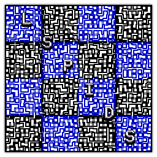
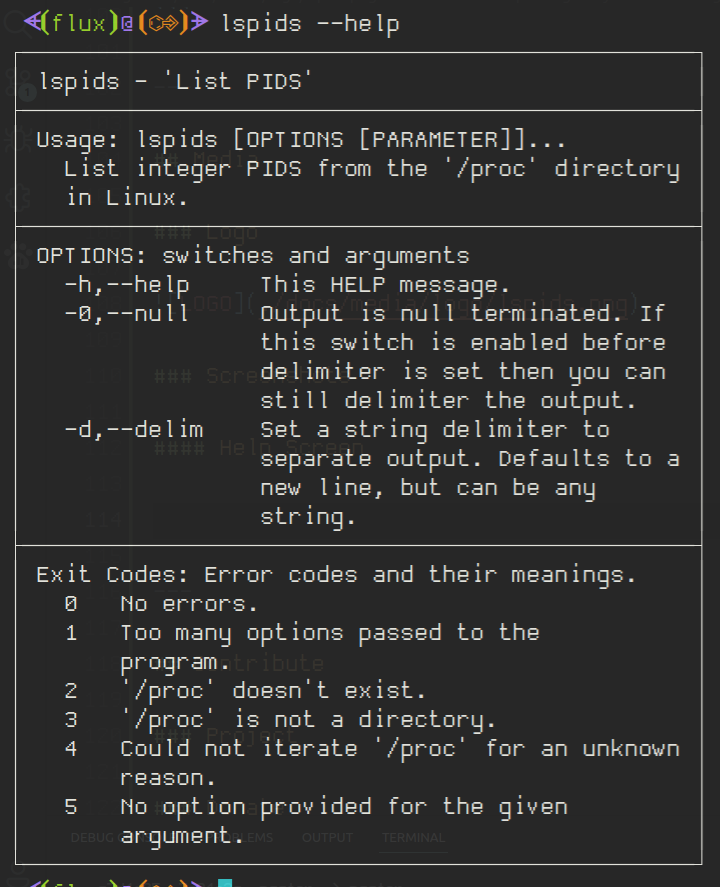
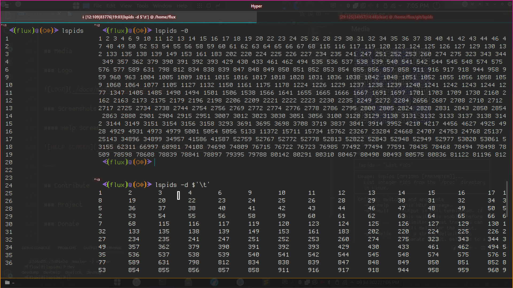
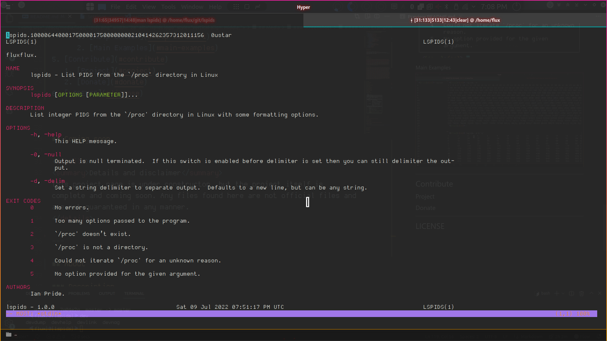

# List PIDS 

1. [Coming soon](#coming-soon)
2. [About](#about)
   1. [Description](#description)
   2. [Motivation](#motivation)
3. [Usage](#usage)
   1. [Environment](#environment)
      1. [Files](#files)
      2. [Current Builds MD5](#current-builds-md5)
         1. [Current Linux MD5](#current-linux-md5)
         2. [Current Debian MD5](#current-debian-md5)
      3. [Project Information](#project-information)
   2. [Debian Installer](#debian-installer)
      1. [Deb Install](#deb-install)
      2. [Deb Provides](#deb-provides)
         1. [Bash Completion](#bash-completion)
         2. [HiColor Icon Theme](#hicolor-icon-theme)
         3. [Man Page Entry](#man-page-entry)
   3. [Portable](#portable)
   4. [Build Yourself](#build-yourself)
      1. [Dependencies](#dependencies)
      2. [Build Command](#build-command)
   5. [Bash Completion](#bash-completion-1)
   6. [Examples](#examples)
      1. [Help Screen](#help-screen)
      2. [Normal Usage](#normal-usage)
      3. [List in a null terminated list](#list-in-a-null-terminated-list)
      4. [List in a tab delimted list](#list-in-a-tab-delimted-list)
4. [Media](#media)
   1. [Logo](#logo)
   2. [Screenshots](#screenshots)
      1. [Help Screen](#help-screen-1)
      2. [Main Examples](#main-examples)
      3. [Man Page](#man-page)
5. [Contribute](#contribute)
   1. [Project](#project)
   2. [Donate](#donate)
6. [LICENSE](#license)

<a href="https://twitter.com/intent/tweet?url=https://github.com/Lateralus138/lspids%0D%0A&text=%27lspids%27%20-%20List%20PIDS%20from%20the%20%27%2Fproc%27%20directory%20in%20Linux%20with%20some%20formatting%20options.%20via%20%40thefluxapex&name=medium&hashtags=programming,coding,fun,commandline,Linux" target="_blank"></a>

---

## Coming soon

<details>
<summary>Details and disclaimer</summary>
&#x54;&#x68;&#x69;&#x73;&#x20;&#x70;&#x72;&#x6F;&#x6A;&#x65;&#x63;&#x74;&#x20;&#x70;&#x61;&#x67;&#x65;&#x20;&#x69;&#x73;&#x20;&#x75;&#x6E;&#x64;&#x65;&#x72;&#x20;&#x63;&#x6F;&#x6E;&#x73;&#x74;&#x72;&#x75;&#x63;&#x74;&#x6F;&#x6E;&comma;&#x20;&#x62;&#x75;&#x74;&#x20;&#x74;&#x68;&#x65;&#x20;&#x70;&#x72;&#x6F;&#x6A;&#x65;&#x63;&#x74;&#x20;&#x69;&#x74;&#x73;&#x65;&#x6C;&#x66;&#x20;&#x69;&#x73;&#x20;&#x63;&#x6F;&#x6D;&#x70;&#x6C;&#x65;&#x74;&#x65;&#x20;&#x61;&#x6E;&#x64;&#x20;&#x63;&#x6F;&#x6D;&#x69;&#x6E;&#x67;&#x20;&#x73;&#x6F;&#x6F;&#x6E;&period;&#x20;&#x41;&#x6E;&#x79;&#x20;&#x66;&#x69;&#x6C;&#x65;&#x73;&#x20;&#x66;&#x6F;&#x75;&#x6E;&#x64;&#x20;&#x68;&#x65;&#x72;&#x65;&#x20;&#x61;&#x72;&#x65;&#x20;&#x6E;&#x6F;&#x74;&#x20;&#x6F;&#x66;&#x66;&#x69;&#x63;&#x69;&#x61;&#x6C;&#x20;&#x66;&#x69;&#x6C;&#x65;&#x73;&#x20;&#x61;&#x6E;&#x64;&#x20;&#x61;&#x72;&#x65;&#x20;&#x6E;&#x6F;&#x74;&#x20;&#x67;&#x75;&#x61;&#x72;&#x61;&#x6E;&#x74;&#x65;&#x65;&#x64;&#x20;&#x69;&#x6E;&#x20;&#x61;&#x6E;&#x79;&#x20;&#x6D;&#x61;&#x6E;&#x6E;&#x65;&#x72;&period;
</details>

---

## About

&#x44;&#x65;&#x73;&#x63;&#x72;&#x69;&#x70;&#x74;&#x69;&#x6F;&#x6E;&#x20;&#x6F;&#x66;&#x20;&#x61;&#x6E;&#x64;&#x20;&#x69;&#x6E;&#x66;&#x6F;&#x72;&#x6D;&#x61;&#x74;&#x69;&#x6F;&#x6E;&#x20;&#x61;&#x62;&#x6F;&#x75;&#x74;&#x20;&#x74;&#x68;&#x69;&#x73;&#x20;&#x70;&#x72;&#x6F;&#x6A;&#x65;&#x63;&#x74;&period;

### Description

&#x4C;&#x69;&#x73;&#x74;&#x20;&#x69;&#x6E;&#x74;&#x65;&#x67;&#x65;&#x72;&#x20;***&#x50;&#x49;&#x44;&#x53;***&#x20;&lpar;*&#x70;&#x72;&#x6F;&#x63;&#x65;&#x73;&#x73;&#x20;&#x69;&#x64;&#x65;&#x6E;&#x74;&#x69;&#x66;&#x69;&#x63;&#x61;&#x74;&#x69;&#x6F;&#x6E;&#x20;&#x6E;&#x75;&#x6D;&#x62;&#x65;&#x72;&#x73;*&rpar;&#x20;&#x66;&#x72;&#x6F;&#x6D;&#x20;&#x74;&#x68;&#x65;&#x20;&apos;**&sol;&#x70;&#x72;&#x6F;&#x63;**&apos;&#x20;&#x64;&#x69;&#x72;&#x65;&#x63;&#x74;&#x6F;&#x72;&#x79;&#x20;&#x69;&#x6E;&#x20;&#x4C;&#x69;&#x6E;&#x75;&#x78;&#x20;&#x77;&#x69;&#x74;&#x68;&#x20;&#x73;&#x6F;&#x6D;&#x65;&#x20;&#x66;&#x6F;&#x72;&#x6D;&#x61;&#x74;&#x74;&#x69;&#x6E;&#x67;&#x20;&#x6F;&#x70;&#x74;&#x69;&#x6F;&#x6E;&#x73;&period;

### Motivation

&#x49;&#x20;&#x64;&#x6F;&#x20;&#x61;&#x20;&#x6C;&#x6F;&#x74;&#x20;&#x77;&#x69;&#x74;&#x68;&#x20;***&#x70;&#x69;&#x64;&#x73;***&#x20;&#x61;&#x63;&#x72;&#x6F;&#x73;&#x73;&#x20;&#x61;&#x6C;&#x6C;&#x20;&#x6F;&#x70;&#x65;&#x72;&#x61;&#x74;&#x69;&#x6E;&#x67;&#x20;&#x73;&#x79;&#x73;&#x74;&#x65;&#x6D;&#x73;&#x20;&lpar;&#x61;&#x73;&#x20;&#x77;&#x69;&#x74;&#x68;&#x20;&#x6D;&#x6F;&#x73;&#x74;&#x20;&#x63;&#x6F;&#x6D;&#x70;&#x75;&#x74;&#x65;&#x72;&#x20;&#x6F;&#x72;&#x69;&#x65;&#x6E;&#x74;&#x65;&#x64;&#x20;&#x70;&#x65;&#x6F;&#x70;&#x6C;&#x65;&rpar;&#x20;&#x61;&#x6E;&#x64;&#x20;&#x49;&#x20;&#x6F;&#x66;&#x74;&#x65;&#x6E;&#x20;&#x6E;&#x65;&#x65;&#x64;&#x20;&#x61;&#x20;&#x71;&#x75;&#x69;&#x63;&#x6B;&#x20;&#x6C;&#x69;&#x73;&#x74;&#x20;&#x6F;&#x72;&#x20;&#x61;&#x72;&#x72;&#x61;&#x79;&#x20;&#x6F;&#x66;&#x20;&#x73;&#x61;&#x69;&#x64;&#x20;&#x70;&#x69;&#x64;&#x73;&#x20;&#x77;&#x69;&#x74;&#x68;&#x20;&#x76;&#x61;&#x72;&#x69;&#x6F;&#x75;&#x73;&#x20;&#x66;&#x6F;&#x72;&#x6D;&#x61;&#x74;&#x74;&#x69;&#x6E;&#x67;&#x20;&#x61;&#x6E;&#x64;&#x20;&#x74;&#x68;&#x69;&#x73;&#x20;&#x70;&#x72;&#x6F;&#x67;&#x72;&#x61;&#x6D;&#x20;&#x70;&#x72;&#x6F;&#x76;&#x69;&#x64;&#x65;&#x73;&#x20;&#x74;&#x68;&#x65;&#x73;&#x65;&#x20;&#x66;&#x65;&#x61;&#x74;&#x75;&#x72;&#x65;&#x73;&#x20;&#x69;&#x6E;&#x20;&#x61;&#x20;&#x71;&#x75;&#x69;&#x63;&#x6B;&#x20;&#x61;&#x6E;&#x64;&#x20;&#x73;&#x69;&#x6D;&#x70;&#x6C;&#x65;&#x20;&#x6D;&#x61;&#x6E;&#x6E;&#x65;&#x72;&period;

---

## Usage

&#x57;&#x68;&#x65;&#x6E;&comma;&#x20;&#x77;&#x68;&#x65;&#x72;&#x65;&comma;&#x20;&#x61;&#x6E;&#x64;&#x20;&#x68;&#x6F;&#x77;&#x20;&#x74;&#x6F;&#x20;&#x75;&#x73;&#x65;&#x20;&#x74;&#x68;&#x69;&#x73;&#x20;&#x70;&#x72;&#x6F;&#x67;&#x72;&#x61;&#x6D;&period;

### Environment

&#x54;&#x68;&#x69;&#x73;&#x20;&#x69;&#x73;&#x20;&#x61;&#x6E;&#x20;&#x6F;&#x70;&#x65;&#x6E;&#x2D;&#x73;&#x6F;&#x75;&#x72;&#x63;&#x65;&#x20;&lpar;***&#x46;&#x4F;&#x53;&#x53;***&rpar;&#x20;&#x63;&#x6F;&#x6D;&#x6D;&#x61;&#x6E;&#x64;&#x20;&#x6C;&#x69;&#x6E;&#x65;&#x20;&#x75;&#x74;&#x69;&#x6C;&#x69;&#x74;&#x79;&#x20;&#x66;&#x6F;&#x72;&#x20;&#x75;&#x73;&#x65;&#x20;&#x69;&#x6E;&#x20;&#x4C;&#x69;&#x6E;&#x75;&#x78;&#x20;&#x73;&#x68;&#x65;&#x6C;&#x6C;&#x73;&#x20;&lpar;&#x74;&#x65;&#x72;&#x6D;&#x69;&#x6E;&#x61;&#x6C;&#x73;&sol;&#x74;&#x74;&#x79;&#x73;&sol;&#x65;&#x74;&#x63;&period;&rpar;&period;&#x20;&#x54;&#x68;&#x69;&#x73;&#x20;&#x63;&#x61;&#x6E;&#x20;&#x62;&#x65;&#x20;&#x62;&#x75;&#x69;&#x6C;&#x74;&#x20;&#x66;&#x72;&#x6F;&#x6D;&#x20;&#x73;&#x6F;&#x75;&#x72;&#x63;&#x65;&#x20;&lpar;&#x61;&#x73;&#x20;&#x70;&#x65;&#x72;&#x20;&#x74;&#x68;&#x65;&#x20;[LICENSE](./LICENSE)&#x20;&#x66;&#x69;&#x6C;&#x65;&#x20;&#x70;&#x72;&#x6F;&#x76;&#x69;&#x64;&#x65;&#x64;&rpar;&comma;&#x20;&#x75;&#x73;&#x65;&#x64;&#x20;&#x70;&#x6F;&#x72;&#x74;&#x61;&#x62;&#x6C;&#x79;&#x20;&lpar;&#x73;&#x69;&#x6E;&#x67;&#x6C;&#x65;&#x20;&#x65;&#x78;&#x65;&#x63;&#x75;&#x74;&#x61;&#x62;&#x6C;&#x65;&#x20;&#x70;&#x75;&#x74;&#x20;&#x77;&#x68;&#x65;&#x72;&#x65;&#x76;&#x65;&#x72;&#x20;&#x79;&#x6F;&#x75;&#x20;&#x6C;&#x69;&#x6B;&#x65;&rpar;&comma;&#x20;&#x6F;&#x72;&#x20;&#x69;&#x6E;&#x73;&#x74;&#x61;&#x6C;&#x6C;&#x65;&#x64;&#x20;&#x76;&#x69;&#x61;&#x20;&#x74;&#x68;&#x65;&#x20;&#x70;&#x72;&#x6F;&#x76;&#x69;&#x64;&#x65;&#x64;&#x20;**&#x44;&#x65;&#x62;&#x69;&#x61;&#x6E;&#x20;**&lpar;**&period;&#x64;&#x65;&#x62;**&rpar;&#x20;&#x70;&#x61;&#x63;&#x6B;&#x61;&#x67;&#x65;&period;&#x20;

&#x54;&#x68;&#x65;&#x20;&#x72;&#x65;&#x63;&#x6F;&#x6D;&#x6D;&#x65;&#x6E;&#x64;&#x65;&#x64;&#x20;&#x6D;&#x65;&#x74;&#x68;&#x6F;&#x64;&#x20;&#x6F;&#x66;&#x20;&#x75;&#x73;&#x65;&#x20;&#x69;&#x73;&#x20;&#x76;&#x69;&#x61;&#x20;&#x74;&#x68;&#x65;&#x20;&#x44;&#x65;&#x62;&#x69;&#x61;&#x6E;&#x20;&#x70;&#x61;&#x63;&#x6B;&#x61;&#x67;&#x65;&#x20;&#x69;&#x6E;&#x73;&#x74;&#x61;&#x6C;&#x6C;&#x61;&#x74;&#x69;&#x6F;&#x6E;&#x20;&#x66;&#x6F;&#x72;&#x20;&#x74;&#x68;&#x65;&#x20;&#x44;&#x65;&#x62;&#x69;&#x61;&#x6E;&#x20;&lpar;&#x61;&#x70;&#x74;&comma;&#x20;&#x64;&#x65;&#x62;&rpar;&#x20;&#x70;&#x61;&#x63;&#x6B;&#x61;&#x67;&#x65;&#x72;&#x20;&#x6D;&#x61;&#x6E;&#x61;&#x67;&#x65;&#x72;&comma;&#x20;&#x62;&#x75;&#x74;&#x20;&#x74;&#x68;&#x65;&#x72;&#x65;&#x20;&#x61;&#x72;&#x65;&#x20;&#x6F;&#x74;&#x68;&#x65;&#x72;&#x20;&#x6D;&#x65;&#x74;&#x68;&#x6F;&#x64;&#x73;&#x20;&#x70;&#x72;&#x6F;&#x76;&#x69;&#x64;&#x65;&#x64;&#x20;&#x68;&#x65;&#x72;&#x65;&#x20;&#x6F;&#x72;&#x20;&#x69;&#x66;&#x20;&#x79;&#x6F;&#x75;&#x20;&#x77;&#x6F;&#x75;&#x6C;&#x64;&#x20;&#x63;&#x61;&#x72;&#x65;&#x20;&#x74;&#x6F;&#x20;&#x70;&#x72;&#x6F;&#x76;&#x69;&#x64;&#x65;&#x20;&#x61;&#x6E;&#x20;&#x69;&#x6E;&#x73;&#x74;&#x61;&#x6C;&#x6C;&#x65;&#x72;&#x20;&#x66;&#x6F;&#x72;&#x20;&#x61;&#x20;&#x64;&#x69;&#x66;&#x66;&#x65;&#x72;&#x65;&#x6E;&#x74;&#x20;&#x70;&#x61;&#x63;&#x6B;&#x61;&#x67;&#x65;&#x20;&#x6D;&#x61;&#x6E;&#x61;&#x67;&#x65;&#x72;&#x20;&#x74;&#x68;&#x65;&#x6E;&#x20;&#x70;&#x6C;&#x65;&#x61;&#x73;&#x65;&#x20;&#x66;&#x6F;&#x72;&#x6B;&#x20;&#x74;&#x68;&#x69;&#x73;&#x20;&#x70;&#x72;&#x6F;&#x6A;&#x65;&#x63;&#x74;&comma;&#x20;&#x62;&#x75;&#x69;&#x6C;&#x64;&#x20;&#x74;&#x68;&#x65;&#x20;&#x61;&#x70;&#x70;&#x72;&#x6F;&#x70;&#x72;&#x69;&#x61;&#x74;&#x65;&#x20;&#x77;&#x6F;&#x72;&#x6B;&#x66;&#x6C;&#x6F;&#x77;&#x20;&#x61;&#x6E;&#x64;&#x20;&#x73;&#x6F;&#x75;&#x72;&#x63;&#x65;&#x20;&#x66;&#x69;&#x6C;&#x65;&#x73;&comma;&#x20;&#x61;&#x6E;&#x64;&#x20;&#x6D;&#x61;&#x6B;&#x65;&#x20;&#x61;&#x20;&#x70;&#x75;&#x6C;&#x6C;&#x2D;&#x72;&#x65;&#x71;&#x75;&#x65;&#x73;&#x74;&period;&#x20;&#x4D;&#x6F;&#x72;&#x65;&#x20;&#x69;&#x6E;&#x66;&#x6F;&#x72;&#x6D;&#x61;&#x74;&#x69;&#x6F;&#x6E;&#x20;&#x61;&#x62;&#x6F;&#x75;&#x74;&#x20;&#x63;&#x6F;&#x6E;&#x74;&#x72;&#x69;&#x62;&#x75;&#x74;&#x69;&#x6E;&#x67;&#x20;[here](#contribute)&period;

#### Files

&#x41;&#x6C;&#x6C;&#x20;&#x63;&#x75;&#x72;&#x72;&#x65;&#x6E;&#x74;&#x6C;&#x79;&#x20;&#x62;&#x75;&#x69;&#x6C;&#x74;&#x20;&#x61;&#x6E;&#x64;&#x20;&#x72;&#x65;&#x6C;&#x65;&#x61;&#x73;&#x65;&#x64;&#x20;&#x66;&#x69;&#x6C;&#x65;&#x73;&#x20;&#x63;&#x61;&#x6E;&#x20;&#x62;&#x65;&#x20;&#x66;&#x6F;&#x75;&#x6E;&#x64;&#x20;&#x61;&#x74;&#x20;&#x74;&#x68;&#x65;&#x20;&#x72;&#x65;&#x6C;&#x65;&#x61;&#x73;&#x65;&#x73;&#x20;&#x70;&#x61;&#x67;&#x65;&colon;

[Releases](https://github.com/Lateralus138/lspids/releases)

#### Current Builds MD5

&#x54;&#x68;&#x69;&#x73;&#x20;&#x69;&#x6E;&#x66;&#x6F;&#x72;&#x6D;&#x61;&#x74;&#x69;&#x6F;&#x6E;&#x20;&#x69;&#x73;&#x20;&#x67;&#x65;&#x6E;&#x65;&#x72;&#x61;&#x74;&#x65;&#x64;&#x20;&#x69;&#x6E;&#x20;&#x61;&#x20;*GitHub Action*&#x20;&#x69;&#x6D;&#x6D;&#x65;&#x64;&#x69;&#x61;&#x74;&#x65;&#x6C;&#x79;&#x20;&#x61;&#x66;&#x74;&#x65;&#x72;&#x20;&#x74;&#x68;&#x65;&#x20;&#x73;&#x75;&#x63;&#x63;&#x65;&#x73;&#x73;&#x66;&#x75;&#x6C;&#x20;&#x62;&#x75;&#x69;&#x6C;&#x64;&#x20;&#x6F;&#x66;&#x20;&#x74;&#x68;&#x69;&#x73;&#x20;&#x70;&#x72;&#x6F;&#x6A;&#x65;&#x63;&#x74;&period;

##### Current Linux MD5


##### Current Debian MD5


#### Project Information

[Code Factor IO](https://www.codefactor.io/) grade from combined source files and workflow scripts in this project (currently 7 files).


### Debian Installer

&#x49;&#x20;&#x70;&#x65;&#x72;&#x73;&#x6F;&#x6E;&#x61;&#x6C;&#x6C;&#x79;&#x20;&#x72;&#x65;&#x63;&#x6F;&#x6D;&#x6D;&#x65;&#x6E;&#x64;&#x20;&#x74;&#x68;&#x69;&#x73;&#x20;&#x6D;&#x65;&#x74;&#x68;&#x6F;&#x64;&#x20;&#x61;&#x73;&#x20;&#x69;&#x74;&#x20;&#x61;&#x75;&#x74;&#x6F;&#x6D;&#x61;&#x74;&#x69;&#x63;&#x61;&#x6C;&#x6C;&#x79;&#x20;&#x69;&#x6E;&#x73;&#x74;&#x61;&#x6C;&#x6C;&#x73;&#x20;&#x61;&#x20;&#x62;&#x61;&#x73;&#x69;&#x63;&#x20;&#x42;&#x61;&#x73;&#x68;&#x20;&#x43;&#x6F;&#x6D;&#x70;&#x6C;&#x65;&#x74;&#x69;&#x6F;&#x6E;&#x20;&#x66;&#x69;&#x6C;&#x65;&comma;&#x20;&#x61;&#x20;&#x68;&#x69;&#x63;&#x6F;&#x6C;&#x6F;&#x72;&#x20;&#x69;&#x63;&#x6F;&#x6E;&#x20;&#x74;&#x68;&#x65;&#x6D;&#x65;&comma;&#x20;&#x61;&#x6E;&#x64;&#x20;&#x61;&#x20;&#x6D;&#x61;&#x6E;&#x20;&#x70;&#x61;&#x67;&#x65;&#x20;&#x65;&#x6E;&#x74;&#x72;&#x79;&period;

#### Deb Install

1. &#x44;&#x6F;&#x77;&#x6E;&#x6C;&#x6F;&#x61;&#x64;&#x20;&#x61;&#x6E;&#x64;&#x20;&#x69;&#x6E;&#x73;&#x74;&#x61;&#x6C;&#x6C;&#x20;&#x74;&#x68;&#x65;&#x20;&#x63;&#x75;&#x72;&#x72;&#x65;&#x6E;&#x74;&#x20;&period;&#x64;&#x65;&#x62;&#x20;&#x69;&#x6E;&#x73;&#x74;&#x61;&#x6C;&#x6C;&#x65;&#x72;&#x20;&#x66;&#x69;&#x6C;&#x65;&#x20;&#x61;&#x74;&#x20;&#x74;&#x68;&#x65;&#x20;[releases page](https://github.com/Lateralus138/lspids/releases)&period;
2. &#x55;&#x73;&#x65;&#x20;&#x6F;&#x6E;&#x65;&#x20;&#x6F;&#x66;&#x20;&#x76;&#x61;&#x72;&#x69;&#x6F;&#x75;&#x73;&#x20;&#x63;&#x6F;&#x6D;&#x6D;&#x61;&#x6E;&#x64;&#x20;&#x6C;&#x69;&#x6E;&#x65;&#x20;&#x74;&#x6F;&#x6F;&#x6C;&#x73;&#x20;&#x74;&#x6F;&#x20;&#x69;&#x6E;&#x73;&#x74;&#x61;&#x6C;&#x6C;&#x20;&#x74;&#x68;&#x65;&#x20;&#x70;&#x61;&#x63;&#x6B;&#x61;&#x67;&#x65;&colon;
    1. APT
    ```Bash
    sudo apt install /path/to/lspids-1.0.0.deb -y
    # -y to skip affirmation, not necessary
    ``` 
    2. DPKG
    ```Bash
    sudo dpkg -i /path/to/lspids-1.0.0.deb
    ```
    3. GDEBI
    ```Bash
    gdebi-gtk /path/to/lspids-1.0.0.deb
    # or
    sudo gdebi /path/to/lspids-1.0.0.deb
    ```
#### Deb Provides

&#x54;&#x68;&#x65;&#x20;&#x64;&#x65;&#x62;&#x20;&#x69;&#x6E;&#x73;&#x74;&#x61;&#x6C;&#x6C;&#x65;&#x72;&#x20;&#x70;&#x72;&#x6F;&#x76;&#x69;&#x64;&#x65;&#x73;&#x20;&#x61;&#x20;&#x66;&#x65;&#x77;&#x20;&#x66;&#x65;&#x61;&#x74;&#x75;&#x72;&#x65;&#x73;&#x20;&lpar;&#x61;&#x6D;&#x6F;&#x6E;&#x67;&#x20;&#x70;&#x72;&#x6F;&#x76;&#x69;&#x64;&#x69;&#x6E;&#x67;&#x20;&#x61;&#x20;&#x77;&#x61;&#x79;&#x20;&#x74;&#x6F;&#x20;&#x63;&#x6C;&#x65;&#x61;&#x6E;&#x79;&#x20;&#x69;&#x6E;&#x73;&#x74;&#x61;&#x6C;&#x6C;&#x20;&#x61;&#x6E;&#x64;&#x20;&#x75;&#x6E;&#x69;&#x6E;&#x73;&#x74;&#x61;&#x6C;&#x6C;&#x20;&#x61;&#x6C;&#x6C;&#x20;&#x66;&#x65;&#x61;&#x74;&#x75;&#x72;&#x65;&#x73;&rpar;&colon;&#x20;

##### Bash Completion

&#x54;&#x68;&#x65;&#x20;[Bash Completion File](debian/lspids-1.0.0/usr/share/bash-completion/completions/lspids)&#x20;&#x70;&#x72;&#x6F;&#x76;&#x69;&#x64;&#x65;&#x73;&#x20;&#x62;&#x61;&#x73;&#x69;&#x63;&#x20;&#x42;&#x61;&#x73;&#x68;&#x20;&#x63;&#x6F;&#x6D;&#x70;&#x6C;&#x65;&#x74;&#x69;&#x6F;&#x6E;&#x20;&#x66;&#x6F;&#x72;&#x20;&#x73;&#x77;&#x69;&#x74;&#x63;&#x68;&#x65;&#x73;&#x20;&#x61;&#x6E;&#x64;&#x20;&#x70;&#x61;&#x72;&#x61;&#x6D;&#x65;&#x74;&#x65;&#x72;&#x73;&#x20;&#x61;&#x6E;&#x64;&#x20;&#x69;&#x73;&#x20;&#x69;&#x6E;&#x73;&#x74;&#x61;&#x6C;&#x6C;&#x65;&#x64;&#x20;&#x74;&#x6F;&#x20;`/usr/share/bash-completion/completions/lspids`&#x20;&#x77;&#x68;&#x65;&#x6E;&#x20;&#x69;&#x6E;&#x73;&#x74;&#x61;&#x6C;&#x6C;&#x65;&#x64;&#x20;&#x77;&#x69;&#x74;&#x68;&#x20;&#x74;&#x68;&#x65;&#x20;&#x64;&#x65;&#x62;&#x20;&#x70;&#x61;&#x63;&#x6B;&#x61;&#x67;&#x65;&period;

&#x4D;&#x6F;&#x72;&#x65;&#x20;&#x69;&#x6E;&#x66;&#x6F;&#x6D;&#x61;&#x74;&#x69;&#x6F;&#x6E;&#x20;&#x63;&#x61;&#x6E;&#x20;&#x62;&#x65;&#x20;&#x66;&#x6F;&#x75;&#x6E;&#x64;&#x20;&#x68;&#x65;&#x72;&#x65;&colon;

[Bash Completion](#bash-completion-1)

##### HiColor Icon Theme

&#x54;&#x68;&#x65;&#x20;&#x64;&#x65;&#x62;&#x20;&#x70;&#x61;&#x63;&#x6B;&#x61;&#x67;&#x65;&#x20;&#x69;&#x6E;&#x73;&#x74;&#x61;&#x6C;&#x6C;&#x65;&#x72;&#x20;&#x70;&#x72;&#x6F;&#x76;&#x69;&#x64;&#x65;&#x20;&#x61;&#x6E;&#x20;&#x69;&#x63;&#x6F;&#x6E;&#x20;&#x74;&#x68;&#x65;&#x6D;&#x65;&#x20;&#x66;&#x6F;&#x72;&#x20;&#x48;&#x69;&#x43;&#x6F;&#x6C;&#x6F;&#x72;&#x20;&#x69;&#x6E;&#x20;&#x63;&#x61;&#x73;&#x65;&#x20;&#x79;&#x6F;&#x75;&#x20;&#x77;&#x61;&#x6E;&#x74;&#x20;&#x74;&#x6F;&#x20;&#x6D;&#x61;&#x6B;&#x65;&#x20;&#x61;&#x20;&period;&#x64;&#x65;&#x73;&#x6B;&#x74;&#x6F;&#x70;&#x20;&#x73;&#x68;&#x6F;&#x72;&#x74;&#x63;&#x75;&#x74;&#x20;&#x6F;&#x72;&#x20;&#x61;&#x6E;&#x79;&#x74;&#x68;&#x69;&#x6E;&#x67;&#x20;&#x65;&#x6C;&#x73;&#x65;&period;&#x20;&#x49;&#x63;&#x6F;&#x6E;&#x73;&#x20;&#x61;&#x72;&#x65;&#x20;&#x69;&#x6E;&#x73;&#x74;&#x61;&#x6C;&#x6C;&#x65;&#x64;&#x20;&#x74;&#x6F;&#x20;`/usr/share/icons/hicolor/{16,32,48,64,128,256}/apps/lspids.png`&period;


##### Man Page Entry

&#x54;&#x68;&#x65;&#x20;&#x6D;&#x61;&#x6E;&#x75;&#x61;&#x6C;&#x20;&#x70;&#x61;&#x67;&#x65;&#x20;&#x69;&#x73;&#x20;&#x61;&#x20;&#x6D;&#x6F;&#x72;&#x65;&#x20;&#x61;&#x64;&#x76;&#x61;&#x6E;&#x63;&#x65;&#x64;&#x20;&#x76;&#x65;&#x72;&#x69;&#x6F;&#x6E;&#x20;&#x6F;&#x66;&#x20;&#x61;&#x20;&#x48;&#x65;&#x6C;&#x70;&#x20;&#x4D;&#x65;&#x73;&#x73;&#x61;&#x67;&#x65;&#x20;&#x61;&#x6E;&#x64;&#x20;&#x63;&#x61;&#x6E;&#x20;&#x62;&#x65;&#x20;&#x61;&#x63;&#x63;&#x65;&#x73;&#x73;&#x65;&#x64;&#x20;&#x66;&#x72;&#x6F;&#x6D;&#x20;&#x74;&#x68;&#x65;&#x20;&#x63;&#x6F;&#x6D;&#x6D;&#x61;&#x6E;&#x64;&#x20;&#x6C;&#x69;&#x6E;&#x65;&#x20;&#x76;&#x69;&#x61;&colon;&#x20;`man lspids`&period;

```Bash
 $ man lspids
...
NAME
       lspids - List PIDS from the `/proc' directory in Linux

SYNOPSIS
       lspids [OPTIONS [PARAMETER]]...

DESCRIPTION
       List integer PIDS from the `/proc' directory in Linux with some formatting options.

OPTIONS
       -h, –help
              This HELP message.

       -0, –null
              Output is null terminated.  If this switch is enabled before delimiter is set then you can still delimiter the output.

       -d, –delim
              Set a string delimiter to separate output.  Defaults to a new line, but can be any string.

EXIT CODES
       0      No errors.

       1      Too many options passed to the program.

       2      `/proc' doesn’t exist.

       3      `/proc' is not a directory.

       4      Could not iterate `/proc' for an unknown reason.

       5      No option provided for the given argument.

AUTHORS
       Ian Pride.

lspids - 1.0.0                                                     Sat 09 Jul 2022 07:51:17 PM UTC                                                          LSPIDS(1)
```

### Portable

&#x59;&#x6F;&#x75;&#x20;&#x63;&#x61;&#x6E;&#x20;&#x75;&#x73;&#x65;&#x20;&#x74;&#x68;&#x69;&#x73;&#x20;&#x70;&#x6F;&#x72;&#x74;&#x61;&#x62;&#x6C;&#x79;&#x20;&#x62;&#x79;&#x20;&#x64;&#x6F;&#x77;&#x6E;&#x6C;&#x6F;&#x61;&#x64;&#x69;&#x6E;&#x67;&#x20;&#x74;&#x68;&#x65;&#x20;`lspids`&#x20;&#x65;&#x78;&#x65;&#x63;&#x75;&#x74;&#x61;&#x62;&#x6C;&#x65;&#x20;&#x62;&#x69;&#x6E;&#x20;&#x66;&#x69;&#x6C;&#x65;&#x20;&#x66;&#x72;&#x6F;&#x6D;&#x20;&#x74;&#x68;&#x65;&#x20;[releases page](https://github.com/Lateralus138/lspids/releases)&#x20;&#x61;&#x6E;&#x64;&#x20;&#x70;&#x75;&#x74;&#x74;&#x69;&#x6E;&#x67;&#x20;&#x69;&#x74;&#x20;&#x61;&#x6E;&#x79;&#x77;&#x68;&#x65;&#x72;&#x65;&#x20;&#x79;&#x6F;&#x75;&#x20;&#x6C;&#x69;&#x6B;&#x65;&semi;&#x20;&#x6D;&#x6F;&#x73;&#x74;&#x20;&#x70;&#x72;&#x65;&#x66;&#x65;&#x72;&#x61;&#x62;&#x6C;&#x79;&#x20;&#x69;&#x6E;&#x20;&#x6F;&#x6E;&#x65;&#x20;&#x6F;&#x66;&#x20;&#x79;&#x6F;&#x75;&#x72;&#x20;`$PATH`&#x20;&lpar;`echo $PATH`&rpar;&#x20;&#x64;&#x69;&#x72;&#x65;&#x63;&#x74;&#x6F;&#x72;&#x69;&#x65;&#x73;&period;

&#x41;&#x73;&#x20;&#x77;&#x69;&#x74;&#x68;&#x20;&#x61;&#x6E;&#x79;&#x20;&#x65;&#x78;&#x65;&#x63;&#x75;&#x74;&#x61;&#x62;&#x6C;&#x65;&#x20;&#x66;&#x69;&#x6C;&#x65;&#x20;&#x69;&#x6E;&#x20;&#x6D;&#x6F;&#x73;&#x74;&#x20;&#x6F;&#x70;&#x65;&#x72;&#x61;&#x74;&#x69;&#x6E;&#x67;&#x20;&#x73;&#x79;&#x73;&#x74;&#x65;&#x6D;&#x73;&#x20;&#x69;&#x66;&#x20;&#x74;&#x68;&#x69;&#x73;&#x20;&#x69;&#x73;&#x20;&#x6E;&#x6F;&#x74;&#x20;&#x69;&#x6E;&#x73;&#x74;&#x61;&#x6C;&#x6C;&#x65;&#x64;&#x20;&#x74;&#x6F;&#x20;`$PATH`&#x20;&#x74;&#x68;&#x65;&#x6E;&#x20;&#x79;&#x6F;&#x75;&#x20;&#x6D;&#x75;&#x73;&#x74;&#x20;&#x70;&#x72;&#x6F;&#x76;&#x69;&#x64;&#x65;&#x20;&#x74;&#x68;&#x65;&#x20;&#x66;&#x75;&#x6C;&#x6C;&#x20;&#x70;&#x61;&#x74;&#x68;&#x20;&#x77;&#x68;&#x65;&#x6E;&#x20;&#x79;&#x6F;&#x75;&#x20;&#x72;&#x75;&#x6E;&#x20;&#x69;&#x74;&period;&#x20;&#x49;&#x66;&#x20;&#x69;&#x74;&#x20;&#x69;&#x73;&#x20;&#x69;&#x6E;&#x20;&#x79;&#x6F;&#x75;&#x72;&#x20;`$PATH`&#x20;&#x74;&#x68;&#x65;&#x6E;&#x20;&#x79;&#x6F;&#x75;&#x20;&#x63;&#x61;&#x6E;&#x20;&#x6A;&#x75;&#x73;&#x74;&#x20;&#x72;&#x75;&#x6E;&#x20;&#x69;&#x74;&#x20;&#x77;&#x69;&#x74;&#x68;&#x20;&#x74;&#x68;&#x65;&#x20;&#x66;&#x69;&#x6C;&#x65;&#x20;&#x6E;&#x61;&#x6D;&#x65;&period;

```Bash
 # In $PATH
 $ lpsids --help
 # Not in $PATH
 $ /full/or/relative/path/to/lspids --help
```

### Build Yourself

&#x59;&#x6F;&#x75;&#x20;&#x63;&#x61;&#x6E;&comma;&#x20;&#x6F;&#x66;&#x20;&#x63;&#x6F;&#x75;&#x72;&#x73;&#x65;&comma;&#x20;&#x62;&#x75;&#x69;&#x6C;&#x64;&#x20;&#x74;&#x68;&#x69;&#x73;&#x20;&#x79;&#x6F;&#x75;&#x72;&#x73;&#x65;&#x6C;&#x66;&#x20;&#x74;&#x68;&#x65;&#x20;&#x66;&#x72;&#x6F;&#x6D;&#x20;&#x73;&#x6F;&#x75;&#x72;&#x63;&#x65;&#x20;&#x6C;&#x6F;&#x63;&#x61;&#x74;&#x65;&#x64;&#x20;&#x69;&#x6E;&#x20;&#x74;&#x68;&#x65;&#x20;[linux](./linux/)&#x20;&#x64;&#x69;&#x72;&#x65;&#x63;&#x74;&#x6F;&#x72;&#x79;&#x20;&#x6F;&#x66;&#x20;&#x74;&#x68;&#x69;&#x73;&#x20;&#x72;&#x65;&#x70;&#x6F;&#x73;&#x69;&#x74;&#x6F;&#x72;&#x79;&period;&#x20;&#x59;&#x6F;&#x75;&#x20;&#x63;&#x61;&#x6E;&#x20;&#x64;&#x6F;&#x77;&#x6E;&#x6C;&#x6F;&#x61;&#x64;&#x20;&#x74;&#x68;&#x65;&#x20;&#x77;&#x68;&#x6F;&#x6C;&#x65;&#x20;&#x70;&#x72;&#x6F;&#x6A;&#x65;&#x63;&#x74;&#x20;&#x69;&#x6E;&#x20;&#x61;&#x20;&#x63;&#x6F;&#x6D;&#x70;&#x72;&#x65;&#x73;&#x73;&#x65;&#x64;&#x20;&#x61;&#x72;&#x63;&#x68;&#x69;&#x76;&#x65;&#x20;&#x66;&#x72;&#x6F;&#x6D;&#x20;&#x74;&#x68;&#x65;&#x20;&#x63;&#x75;&#x72;&#x72;&#x65;&#x6E;&#x74;&#x20;[releases page](https://github.com/Lateralus138/lspids/releases)&period;

&#x45;&#x78;&#x74;&#x72;&#x61;&#x63;&#x74;&#x20;&#x74;&#x68;&#x65;&#x20;&#x70;&#x72;&#x6F;&#x6A;&#x65;&#x63;&#x74;&#x20;&#x74;&#x6F;&#x20;&#x77;&#x68;&#x65;&#x72;&#x65;&#x76;&#x65;&#x72;&#x20;&#x79;&#x6F;&#x75;&#x20;&#x77;&#x61;&#x6E;&#x74;&#x20;&#x74;&#x6F;&#x20;&#x62;&#x75;&#x69;&#x6C;&#x64;&colon;

```Bash
tar -xvzf /path/to/lspids-1.0.0.tar.gz -C /path/to/where/you/want/to/build 
```

&#x49;&#x20;&#x63;&#x72;&#x65;&#x61;&#x74;&#x65;&#x64;&#x20;&#x61;&#x6E;&#x64;&#x20;&#x75;&#x73;&#x65;&#x20;&#x61;&#x20;&#x63;&#x75;&#x73;&#x74;&#x6F;&#x6D;&#x20;&#x4D;&#x61;&#x6B;&#x65;&#x66;&#x69;&#x6C;&#x65;&#x20;&#x73;&#x79;&#x73;&#x74;&#x65;&#x6D;&#x20;&#x6E;&#x6F;&#x74;&#x20;&#x72;&#x65;&#x6C;&#x69;&#x61;&#x6E;&#x74;&#x20;&#x6F;&#x6E;&#x20;&#x43;&#x4D;&#x41;&#x4B;&#x45;&#x20;&#x61;&#x6E;&#x64;&#x20;&#x6F;&#x6E;&#x6C;&#x79;&#x20;&#x72;&#x65;&#x6C;&#x69;&#x61;&#x6E;&#x74;&#x20;&#x6F;&#x6E;&#x20;&#x47;&#x4E;&#x55;&plus;&plus;&#x31;&#x37;&sol;&#x4D;&#x41;&#x4B;&#x45;&comma;&#x20;&#x62;&#x75;&#x74;&#x20;&#x69;&#x74;&#x20;&#x73;&#x68;&#x6F;&#x75;&#x6C;&#x64;&#x6E;&apos;&#x74;&#x20;&#x62;&#x65;&#x20;&#x74;&#x6F;&#x6F;&#x20;&#x68;&#x61;&#x72;&#x64;&#x20;&#x74;&#x6F;&#x20;&#x66;&#x69;&#x67;&#x75;&#x72;&#x65;&#x20;&#x6F;&#x75;&#x74;&period;&#x20;&#x49;&#x20;&#x62;&#x75;&#x69;&#x6C;&#x64;&#x20;&#x6F;&#x62;&#x6A;&#x65;&#x63;&#x74;&#x73;&#x20;&#x66;&#x72;&#x6F;&#x6D;&#x20;`src/include`&#x20;&#x74;&#x6F;&#x20;&#x61;&#x20;&#x6C;&#x69;&#x62;&#x20;&#x61;&#x72;&#x63;&#x68;&#x69;&#x76;&#x65;&#x20;`src/lib`&#x20;&#x69;&#x6E;&#x20;&#x61;&#x6E;&#x64;&#x20;&#x62;&#x75;&#x69;&#x6C;&#x64;&#x20;&#x77;&#x69;&#x74;&#x68;&#x20;`-Lsrc/lib`&#x20;&#x61;&#x6E;&#x64;&#x20;`-llib<BIN NAME>.a`&period;

#### Dependencies

&#x41;&#x6C;&#x6C;&#x20;&#x70;&#x61;&#x63;&#x6B;&#x61;&#x67;&#x65;&#x73;&#x20;&#x79;&#x6F;&#x75;&#x20;&#x77;&#x69;&#x6C;&#x6C;&#x20;&#x6E;&#x65;&#x65;&#x64;&#x20;&#x74;&#x6F;&#x20;&#x62;&#x75;&#x69;&#x6C;&#x64;&#x20;&#x74;&#x68;&#x69;&#x73;&colon;

`make, g++[4:9,gnu++17], build-essential, binutils`

&#x77;&#x68;&#x69;&#x63;&#x68;&#x20;&#x79;&#x6F;&#x75;&#x20;&#x63;&#x61;&#x6E;&#x20;&#x69;&#x6E;&#x73;&#x74;&#x61;&#x6C;&#x6C;&#x20;&#x69;&#x6E;&#x20;&#x77;&#x69;&#x74;&#x68;&#x20;&#x41;&#x50;&#x54;&#x20;&#x69;&#x6E;&#x20;&#x61;&#x20;&#x44;&#x65;&#x62;&#x69;&#x61;&#x6E;&#x20;&#x62;&#x61;&#x73;&#x65;&#x64;&#x20;&#x73;&#x79;&#x73;&#x74;&#x65;&#x6D;&colon;

```Bash
sudo apt install make g++ build-essential binutils -y
```

#### Build Command

&#x52;&#x75;&#x6E;&#x20;&#x6D;&#x61;&#x6B;&#x65;&#x20;&#x66;&#x69;&#x72;&#x73;&#x74;&#x20;&#x74;&#x6F;&#x20;&#x74;&#x65;&#x73;&#x74;&semi;&#x20;&#x6E;&#x6F;&#x20;&period;&sol;&#x63;&#x6F;&#x6E;&#x66;&#x69;&#x67;&#x75;&#x72;&#x65;&colon;
```Bash
make
```

&#x61;&#x6E;&#x64;&#x20;&#x69;&#x66;&#x20;&#x73;&#x75;&#x63;&#x63;&#x65;&#x73;&#x73;&#x66;&#x75;&#x6C;&semi;&#x20;&#x69;&#x6E;&#x73;&#x74;&#x61;&#x6C;&#x6C;&#x20;&#x61;&#x6E;&#x64;&#x20;&#x63;&#x6C;&#x65;&#x61;&#x6E;&#x20;&lpar;&#x6E;&#x65;&#x65;&#x64;&#x20;&#x74;&#x6F;&#x20;&#x66;&#x69;&#x78;&#x20;&#x74;&#x68;&#x65;&#x20;&#x72;&#x65;&#x67;&#x75;&#x6C;&#x61;&#x72;&#x20;&#x61;&#x6E;&#x64;&#x20;&#x61;&#x6C;&#x6C;&#x20;&#x62;&#x75;&#x69;&#x6C;&#x64;&rpar;&colon;

```Bash
sudo make releasedynamicall install && sudo make clean
```

### Bash Completion

&#x42;&#x61;&#x73;&#x68;&#x20;&#x63;&#x6F;&#x6D;&#x70;&#x6C;&#x65;&#x74;&#x69;&#x6F;&#x6E;&#x20;&#x63;&#x61;&#x6E;&#x20;&#x62;&#x65;&#x20;&#x70;&#x72;&#x6F;&#x76;&#x69;&#x64;&#x65;&#x64;&#x20;&#x62;&#x79;&#x20;&#x70;&#x6C;&#x61;&#x63;&#x69;&#x6E;&#x67;&#x20;&#x74;&#x68;&#x65;&#x20;[lspids](./debian/lspids-1.0.0/usr/share/bash-completion/completions/lspids)&#x20;&#x42;&#x61;&#x73;&#x68;&#x20;&#x63;&#x6F;&#x6D;&#x70;&#x6C;&#x65;&#x74;&#x69;&#x6F;&#x6E;&#x20;&#x66;&#x69;&#x6C;&#x65;&#x20;&#x74;&#x6F;&#x20;`/usr/share/bash-completion/completions`&period;&#x20;&#x54;&#x68;&#x69;&#x73;&#x20;&#x69;&#x73;&#x20;&#x61;&#x6C;&#x72;&#x65;&#x61;&#x64;&#x79;&#x20;&#x64;&#x6F;&#x6E;&#x65;&#x20;&#x69;&#x66;&#x20;&#x69;&#x6E;&#x73;&#x74;&#x61;&#x6C;&#x6C;&#x65;&#x64;&#x20;&#x77;&#x69;&#x74;&#x68;&#x20;&#x61;&#x20;&#x70;&#x61;&#x63;&#x6B;&#x61;&#x67;&#x65;&#x20;&#x6D;&#x61;&#x6E;&#x61;&#x67;&#x65;&#x72;&period;

**lspids** Bash Completion File:

```Bash
lspids_list=(
  -h --help
  -0 --null
  -d --delim
)
complete -W "$(printf '%s\n' "${lspids_list[@]}")" lspids
```

### Examples

#### Help Screen

```Bash
 $ lspids --help
┌────────────────────────────────────────────────┐
│ lspids - 'List PIDS'                           │
├────────────────────────────────────────────────┤
│ Usage: lspids [OPTIONS [PARAMETER]]...         │
│   List integer PIDS from the '/proc' directory │
│   in Linux.                                    │
├────────────────────────────────────────────────┤
│ OPTIONS: switches and arguments                │
│   -h,--help     This HELP message.             │
│   -0,--null     Output is null terminated. If  │
│                 this switch is enabled before  │
│                 delimiter is set then you can  │
│                 still delimiter the output.    │
│   -d,--delim    Set a string delimiter to      │
│                 separate output. Defaults to a │
│                 new line, but can be any       │
│                 string.                        │
├────────────────────────────────────────────────┤
│ Exit Codes: Error codes and their meanings.    │
│   0   No errors.                               │
│   1   Too many options passed to the           │
│       program.                                 │
│   2   '/proc' doesn't exist.                   │
│   3   '/proc' is not a directory.              │
│   4   Could not iterate '/proc' for an unknown │
│       reason.                                  │
│   5   No option provided for the given         │
│       argument.                                │
└────────────────────────────────────────────────┘  
```

#### Normal Usage

```Bash
 $ lspids
...
1641
1655
1665
1666
1667
1691
1697
1701
1703
...
 $
```

#### List in a null terminated list

```Bash
  $ lspids -0 # or --null
...241 247 251 252 253 260 274 275 323 343 344 349 357 362 379 390 391 392 393 429 430 433 461 462 494 535 536 537 538 539 540 541 542 544 545 548 574 575 576 577 589 631 798 812 834 838 839 847 848 849 850 851 852 853 854 855 856 857 858 911 916 917 918 944 958 959 960 963 1004 1005 1009 1011 1015 1016 1017... $
```

#### List in a tab delimted list

```Bash
 $ lspids -d $'\t'
...2160    2162    2163    2173    2175    2179    21962198     2206    2209    2221    2222    2223    2230    2235    2249    2272    2284    2656    2687    2708    2710    27122717     2725    2734    2738    2744    2754    2756    2769    2772    2774    2776    2778    2786    2795    2800    28052824     2828    2831    2843    2850    2854    2863    2880    2901    2904    2915    2951    3007    3012    3023    30303051     3056    3100    3128    3129    3130    3131    3132    3133    3137    3138    3142    3144    3149    3151    31543156     3158    3293    3691    3695    3698    3708    3719    3837    3841...
 $
```

---

## Media

### Logo


### Screenshots

#### Help Screen



#### Main Examples



#### Man Page



---

## Contribute

&#x57;&#x61;&#x79;&#x73;&#x20;&#x79;&#x6F;&#x75;&#x20;&#x63;&#x61;&#x6E;&#x20;&#x68;&#x65;&#x6C;&#x70;&#x20;&#x69;&#x66;&#x20;&#x79;&#x6F;&#x75;&#x20;&#x6C;&#x69;&#x6B;&#x65;&period;

### Project

&#x59;&#x6F;&#x75;&#x20;&#x63;&#x61;&#x6E;&#x20;[fork this project](https:///www.github.com/Lateralus138/lspids/fork)&comma;&#x20;&#x6D;&#x61;&#x6B;&#x65;&#x20;&#x79;&#x6F;&#x75;&#x72;&#x20;&#x63;&#x6F;&#x6E;&#x74;&#x72;&#x69;&#x62;&#x75;&#x74;&#x69;&#x6F;&#x6E;&#x73;&comma;&#x20;&#x61;&#x6E;&#x64;&#x20;&#x6D;&#x61;&#x6B;&#x65;&#x20;&#x61;&#x20;&#x70;&#x75;&#x6C;&#x6C;&#x2D;&#x72;&#x65;&#x71;&#x75;&#x65;&#x73;&#x74;&period;

### Donate

&#x49;&#x66;&#x20;&#x79;&#x6F;&#x75;&#x20;&#x6C;&#x69;&#x6B;&#x65;&#x20;&#x74;&#x68;&#x69;&#x73;&#x20;&#x70;&#x72;&#x6F;&#x6A;&#x65;&#x63;&#x74;&#x20;&#x61;&#x6E;&#x64;&#x20;&#x63;&#x61;&#x72;&#x65;&#x20;&#x74;&#x6F;&#x20;&#x64;&#x6F;&#x6E;&#x61;&#x74;&#x65;&#x20;&#x74;&#x6F;&#x20;&#x6D;&#x79;&#x20;***PayPal***&colon;

[](https://paypal.me/ianapride?locale.x=en_US)

&#x4F;&#x72;&#x20;***Buy Me A Coffee***&#x20;&#x69;&#x66;&#x20;&#x79;&#x6F;&#x75;&#x72;&#x20;&#x70;&#x72;&#x65;&#x66;&#x65;&#x72;&colon;

[](https://www.buymeacoffee.com/ianalanpride)

---

## [LICENSE](./LICENSE)


<details>
  <summary>License Excerpt</summary>
  <br>
  <blockquote>
  &#x20;&#x54;&#x68;&#x69;&#x73;&#x20;&#x70;&#x72;&#x6F;&#x67;&#x72;&#x61;&#x6D;&#x20;&#x69;&#x73;&#x20;&#x66;&#x72;&#x65;&#x65;&#x20;&#x73;&#x6F;&#x66;&#x74;&#x77;&#x61;&#x72;&#x65;&colon;&#x20;&#x79;&#x6F;&#x75;&#x20;&#x63;&#x61;&#x6E;&#x20;&#x72;&#x65;&#x64;&#x69;&#x73;&#x74;&#x72;&#x69;&#x62;&#x75;&#x74;&#x65;&#x20;&#x69;&#x74;&#x20;&#x61;&#x6E;&#x64;&sol;&#x6F;&#x72;&#x20;&#x6D;&#x6F;&#x64;&#x69;&#x66;&#x79;&#x20;&#x69;&#x74;&#x20;&#x75;&#x6E;&#x64;&#x65;&#x72;&#x20;&#x74;&#x68;&#x65;&#x20;&#x74;&#x65;&#x72;&#x6D;&#x73;&#x20;&#x6F;&#x66;&#x20;&#x74;&#x68;&#x65;&#x20;&#x47;&#x4E;&#x55;&#x20;&#x47;&#x65;&#x6E;&#x65;&#x72;&#x61;&#x6C;&#x20;&#x50;&#x75;&#x62;&#x6C;&#x69;&#x63;&#x20;&#x4C;&#x69;&#x63;&#x65;&#x6E;&#x73;&#x65;&#x20;&#x61;&#x73;&#x20;&#x70;&#x75;&#x62;&#x6C;&#x69;&#x73;&#x68;&#x65;&#x64;&#x20;&#x62;&#x79;&#x20;&#x74;&#x68;&#x65;&#x20;&#x46;&#x72;&#x65;&#x65;&#x20;&#x53;&#x6F;&#x66;&#x74;&#x77;&#x61;&#x72;&#x65;&#x20;&#x46;&#x6F;&#x75;&#x6E;&#x64;&#x61;&#x74;&#x69;&#x6F;&#x6E;&comma;&#x20;&#x65;&#x69;&#x74;&#x68;&#x65;&#x72;&#x20;&#x76;&#x65;&#x72;&#x73;&#x69;&#x6F;&#x6E;&#x20;&#x33;&#x20;&#x6F;&#x66;&#x20;&#x74;&#x68;&#x65;&#x20;&#x4C;&#x69;&#x63;&#x65;&#x6E;&#x73;&#x65;&comma;&#x20;&#x6F;&#x72;&#x20;&lpar;&#x61;&#x74;&#x20;&#x79;&#x6F;&#x75;&#x72;&#x20;&#x6F;&#x70;&#x74;&#x69;&#x6F;&#x6E;&rpar;&#x20;&#x61;&#x6E;&#x79;&#x20;&#x6C;&#x61;&#x74;&#x65;&#x72;&#x20;&#x76;&#x65;&#x72;&#x73;&#x69;&#x6F;&#x6E;&period;
  </blockquote>
  <br>
  <blockquote>
  &#x54;&#x68;&#x69;&#x73;&#x20;&#x70;&#x72;&#x6F;&#x67;&#x72;&#x61;&#x6D;&#x20;&#x69;&#x73;&#x20;&#x64;&#x69;&#x73;&#x74;&#x72;&#x69;&#x62;&#x75;&#x74;&#x65;&#x64;&#x20;&#x69;&#x6E;&#x20;&#x74;&#x68;&#x65;&#x20;&#x68;&#x6F;&#x70;&#x65;&#x20;&#x74;&#x68;&#x61;&#x74;&#x20;&#x69;&#x74;&#x20;&#x77;&#x69;&#x6C;&#x6C;&#x20;&#x62;&#x65;&#x20;&#x75;&#x73;&#x65;&#x66;&#x75;&#x6C;&comma;&#x20;&#x62;&#x75;&#x74;&#x20;&#x57;&#x49;&#x54;&#x48;&#x4F;&#x55;&#x54;&#x20;&#x41;&#x4E;&#x59;&#x20;&#x57;&#x41;&#x52;&#x52;&#x41;&#x4E;&#x54;&#x59;&semi;&#x20;&#x77;&#x69;&#x74;&#x68;&#x6F;&#x75;&#x74;&#x20;&#x65;&#x76;&#x65;&#x6E;&#x20;&#x74;&#x68;&#x65;&#x20;&#x69;&#x6D;&#x70;&#x6C;&#x69;&#x65;&#x64;&#x20;&#x77;&#x61;&#x72;&#x72;&#x61;&#x6E;&#x74;&#x79;&#x20;&#x6F;&#x66;&#x20;&#x4D;&#x45;&#x52;&#x43;&#x48;&#x41;&#x4E;&#x54;&#x41;&#x42;&#x49;&#x4C;&#x49;&#x54;&#x59;&#x20;&#x6F;&#x72;&#x20;&#x46;&#x49;&#x54;&#x4E;&#x45;&#x53;&#x53;&#x20;&#x46;&#x4F;&#x52;&#x20;&#x41;&#x20;&#x50;&#x41;&#x52;&#x54;&#x49;&#x43;&#x55;&#x4C;&#x41;&#x52;&#x20;&#x50;&#x55;&#x52;&#x50;&#x4F;&#x53;&#x45;&period;&#x20;&#x20;&#x53;&#x65;&#x65;&#x20;&#x74;&#x68;&#x65;&#x20;&#x47;&#x4E;&#x55;&#x20;&#x47;&#x65;&#x6E;&#x65;&#x72;&#x61;&#x6C;&#x20;&#x50;&#x75;&#x62;&#x6C;&#x69;&#x63;&#x20;&#x4C;&#x69;&#x63;&#x65;&#x6E;&#x73;&#x65;&#x20;&#x66;&#x6F;&#x72;&#x20;&#x6D;&#x6F;&#x72;&#x65;&#x20;&#x64;&#x65;&#x74;&#x61;&#x69;&#x6C;&#x73;&period;
  </blockquote>
</details>

